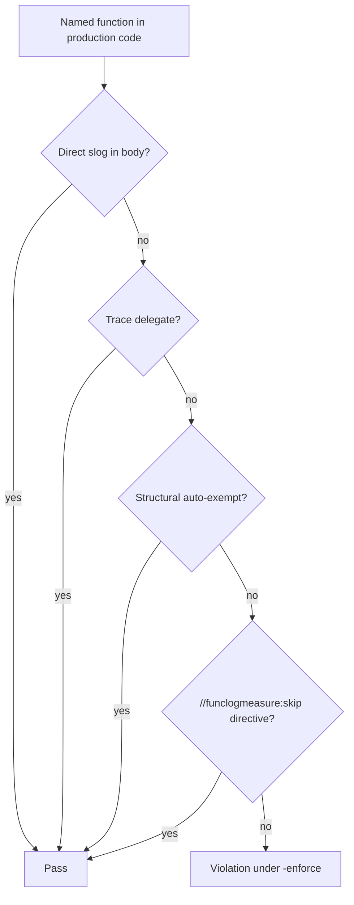

# Observability trace lines

**Applies to:** Go production packages scanned by `cmd/funclogmeasure`; handlers, store, harness, and worker code paths that emit structured logs.

## Overview

T2A enforces a **trace-line contract** on named functions in production Go code: every function must either emit structured logs, delegate to trace infrastructure, match a structural boilerplate exemption, or carry an explicit co-located opt-out. CI runs `go run ./cmd/funclogmeasure -enforce` after tests (see `scripts/check.ps1` / `.github/workflows/ci.yml`).

The contract keeps operation boundaries visible in logs (`call_path`, `helper.io`, stable operation keys) without requiring `slog` in every pure helper or hot-path accessor.

## Key concepts

| Term | Meaning |
| --- | --- |
| Trace-line contract | A named function with a body must satisfy one of four satisfaction layers (below). |
| Direct slog | At least one type-resolved `log/slog` call in the function body (nested func literals do not count for the outer func). |
| Trace delegate | Body calls `calltrace.RunObserved`, `calltrace.HelperIOIn`, or `calltrace.HelperIOOut`, or is a depth-1 thin wrapper to a same-package callee that already satisfies. |
| Structural auto-exempt | Standard boilerplate detected via `go/types` (`error.Error`, `sql.Scanner`, GORM `TableName`, heap/prometheus hooks, `cmd/*/main` → `run()`, etc.). |
| Co-located directive | `//funclogmeasure:skip` on the function with a valid category and reason. |

## Satisfaction layers



### When to use each approach

| Approach | Use when |
| --- | --- |
| **Direct slog** | The function is an operation chokepoint (handler mutation, store write, worker decision). Prefer stable keys and `call_path` from `logctx` / `calltrace`. |
| **`calltrace.RunObserved`** | Thin wrapper around a block that should inherit helper I/O tracing without duplicating slog at every layer. |
| **Auto-exempt** | Do nothing — the tool recognizes interface methods and `cmd/main` patterns automatically. |
| **`//funclogmeasure:skip`** | Legitimate omission: pure helpers, hot-path accessors, re-export middleware, or test-only wiring. |

## Skip categories

| Category | Typical use |
| --- | --- |
| `tool-required-noop` | `cmd/*/main`, test HTTP helpers, tooling entrypoints where slog is configured elsewhere. |
| `hot-path` | Per-chunk I/O, Prometheus collectors, tight loops where boundary logging is canonical. |
| `delegate-already-logs` | Wrappers that only forward to `calltrace` helpers that already emit traces. |
| `re-export-wrapper` | Handler middleware shims that re-export `pkgs/tasks/middleware` implementations. |

## Directive syntax

Place on the `FuncDecl` doc comment group (before any godoc) or as the line immediately above `func`:

```go
//funclogmeasure:skip category=hot-path reason="Pure helper without I/O; operation trace is emitted by the calling chokepoint."
func normalizeTitle(s string) string { ... }
```

**Rules:**

- `category` must be one of the four values above.
- `reason` is required and must be at least 20 characters after trimming.
- Invalid or missing directives fail `-enforce` the same as missing slog.

> **Important** — Do not add entries to `cmd/funclogmeasure` for individual symbols. Exceptions live at the function in source.

## JSON report

`go run ./cmd/funclogmeasure -json` emits satisfaction breakdown:

```json
{
  "funcs_considered": 1403,
  "funcs_satisfied": 1403,
  "funcs_missing_trace": 0,
  "satisfaction": {
    "direct_slog": 900,
    "trace_delegate": 15,
    "auto_exempt": 38,
    "directive": 450
  },
  "violations": []
}
```

## Limitations

- No interprocedural analysis beyond depth-1 same-package wrappers.
- Nested func literals never satisfy the outer function.
- Generated files (`// Code generated`, `DO NOT EDIT`) and `web/node_modules/**/*.go` are skipped.
- `_test.go` files are excluded unless `-tests` is set.

## See also

- [calltrace README](../../pkgs/tasks/calltrace/README.md) — `RunObserved`, `HelperIOIn`/`Out`, `call_path`
- [logctx README](../../pkgs/tasks/logctx/README.md) — `request_id`, log sequence
- [ADR-0029](../adr/ADR-0029-funclogmeasure-category-driven.md) — deletion of central skip map
- `cmd/funclogmeasure/` — analyzer implementation and minimod fixtures
