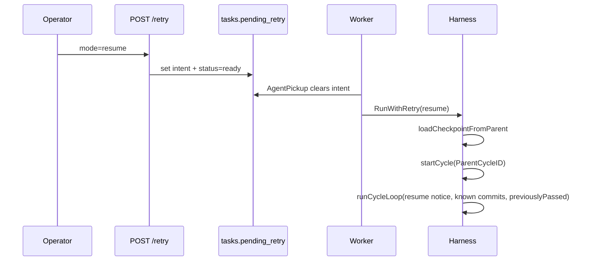

# Resume from failure

Operator **Resume from failure** (`resume` retry) queues a **new execution cycle** that restores checkpoint state from a **terminal parent cycle** while keeping git history intact.

| | |
| --- | --- |
| **Applies to** | `POST /tasks/{id}/retry` with `{ "mode": "resume" }`; `RunWithRetry` → `runResumeRetry`; SPA Resume from failure |
| **Audience** | Contributors touching retry API, continuation bundle, or task detail retry UI |
| **Prerequisite** | [resume-continuation.md](./resume-continuation.md) — `ContinuationBundle` assembly |

## In this article

- [Overview](#overview)
- [Three recovery paths](#three-recovery-paths)
- [Key concepts](#key-concepts)
- [Workflow](#workflow)
- [Checkpoint loading](#checkpoint-loading)
- [Wire contracts](#wire-contracts)
- [Edge cases](#edge-cases)
- [Limitations](#limitations)
- [See also](#see-also)

## Overview

Resume from failure is for operators who want another attempt without losing progress: verify passes, known commits (including **observed** commits from failed execute gates), and retry feedback from the failed parent cycle are injected via the **ContinuationBundle**. The parent cycle row and git history are **never mutated**.

Deep dive: [resume-continuation.md](./resume-continuation.md).

Every operator retry after failure creates a new `task_cycles` row (`attempt_seq` monotonic) with `parent_cycle_id` and `meta.retry_mode = "resume"`.

## Three recovery paths

Do not conflate these paths — trigger, cycle row, git, and checkpoint differ:

| Path | Trigger | Cycle row | Git | Checkpoint |
| --- | --- | --- | --- | --- |
| **ADR-0006 resume** | Process restart; task still `running` | **Same** open cycle | Keep | Same-cycle `reconstructCheckpoint` → `Harness.Resume` |
| **Start over** | Operator; task `failed` | **New** (`ParentCycleID`) | Reset to anchor + clean | None — [retry-start-over.md](./retry-start-over.md) |
| **Resume from failure** | Operator; task `failed` | **New** (`ParentCycleID`) | Keep | Load from **parent** cycle DB rows |

## Key concepts

| Term | Meaning |
| --- | --- |
| **Cross-cycle checkpoint** | Data loaded from a **terminal** parent via `loadCheckpointFromParent`, not from an open running cycle. |
| **verifyAttempt = 0** | Each new attempt gets a fresh verify retry budget; parent `maxAttempt` is not carried forward. |
| **previouslyPassed** | Criteria that already passed verify on the parent are locked for the new attempt. |
| **knownCommits** | All distinct `task_cycle_commits` rows for the task (every prior attempt) feed the resume notice on execute. |
| **Shared loader** | `loadVerifyCheckpointData` is shared with ADR-0006 same-cycle resume; eligibility rules differ. |

## Workflow

1. Operator clicks **Resume from failure**; SPA confirms new attempt with checkpoint carry-forward.
2. Handler/store path identical to fresh retry except `mode=resume` (see [retry-start-over.md](./retry-start-over.md) for validation rules).
3. Worker dispatches `RunWithRetry` with consumed intent.
4. Harness `runResumeRetry`:
   - Loads checkpoint from parent (`loadCheckpointFromParent`).
   - On load failure: task → `failed`, `retry_checkpoint_failed`; no new cycle.
   - On success: `startCycle` with `ParentCycleID` and `meta.retry_mode=resume`.
   - `runCycleLoop` with `resumeNotice`, `knownCommits`, `previouslyPassed`, `verifyAttempt=0`, always entering execute.

> **Note** — Resume retry never mutates parent cycle rows or git history.

## Checkpoint loading

[`loadCheckpointFromParent`](../../pkgs/agents/harness/resume_state.go):

| Input table | Used for |
| --- | --- |
| Parent cycle row | Must be terminal (`failed` or `aborted`) |
| `task_cycle_verify_reports` | `previouslyPassed`, verify feedback |
| `task_cycle_commits` | Task-wide distinct SHAs via `ListCommitsForTask` for resume notice and zero-new-commit ingest inherit |

Contrast with ADR-0006 [`reconstructCheckpoint`](../../pkgs/agents/harness/resume_state.go): same-cycle, open `running` cycle, interrupt phases only.

Execute and verify prompt wiring reuse `cycleLoopOpts` — no duplicated prompt builders.

## Wire contracts

| Surface | Contract |
| --- | --- |
| `POST /tasks/{id}/retry` | Body `{ "mode": "resume", "parent_cycle_id": "<optional>" }`. See [api.md](../api.md). |
| Cycle meta | `retry_mode: "resume"`, `parent_cycle_id` on new cycle |
| SPA lineage | e.g. *Attempt 3 · resumed from attempt 2* via `parent_cycle_id` + meta |
| Failure reason | `retry_checkpoint_failed` when parent load fails |

## Edge cases

| Scenario | Behavior |
| --- | --- |
| Double-click Resume | Same idempotency/conflict rules as fresh — see [retry-start-over.md](./retry-start-over.md) |
| Parent has no verify reports yet | Empty `previouslyPassed`; resume notice + known commits if any |
| Parent `aborted` | Valid terminal parent |
| Non-git repo | Checkpoint from DB only; no git reset |
| Legacy `PATCH failed→ready` | No checkpoint; behaves like first run |
| Worker crash after intent clear | Ordinary run on reconcile (acceptable rare orphan) |

## Limitations

- Does not resume mid-CLI session (runners are stateless).
- Does not reopen a terminal cycle row in place.
- `verifyAttempt` resets per new attempt — operators get a full verify budget again.
- Multi-parent merge and shared-worktree concurrent retries are deferred.

## See also

- [retry-start-over.md](./retry-start-over.md) — Start over (fresh) behavior
- [ADR-0015](../adr/ADR-0015-dual-retry-modes.md) — decision record
- [ADR-0006](../adr/ADR-0006-phase-boundary-resume.md) — same-cycle resume after restart
- [harness.md](./harness.md) — `RunWithRetry`, recovery reasons
- [cycle-commits.md](./cycle-commits.md) — commit index consumed by resume notice
- Code: [`retry_run.go`](../../pkgs/agents/harness/retry_run.go), [`resume_state.go`](../../pkgs/agents/harness/resume_state.go)
