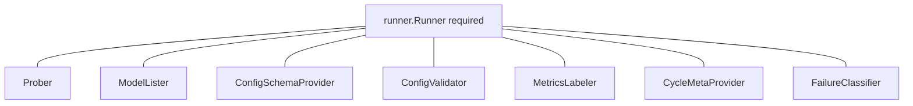
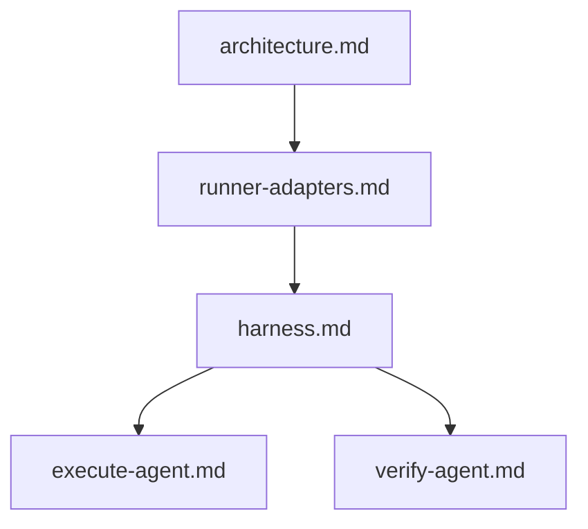
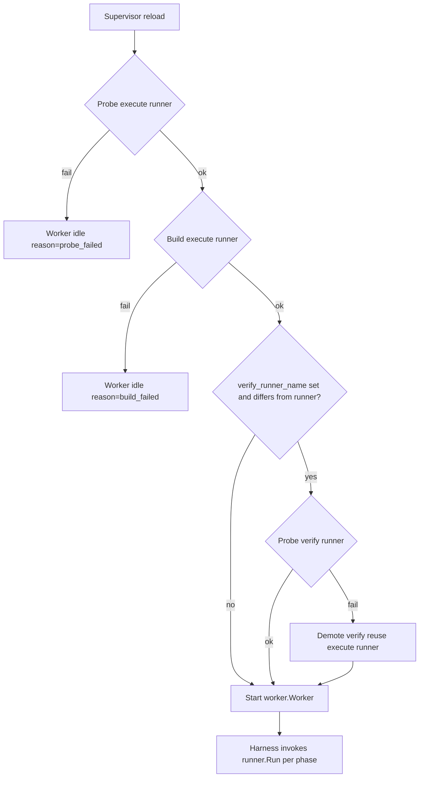

# Runner adapters and registry

How CLI runners plug into T2A: the `runner.Runner` contract, compile-time registration, optional capabilities, supervisor wiring, and HTTP discovery for the Settings UI.

| | |
| --- | --- |
| **Applies to** | `pkgs/agents/runner`, `pkgs/agents/runner/registry`, `pkgs/agents/runner/adapterkit`, `cmd/taskapi/run_agentworker.go`, `pkgs/tasks/handler/handler_runners.go` |
| **Audience** | Contributors adding a new CLI adapter; operators choosing runners in Settings |
| **Prerequisite** | [architecture.md](../architecture.md) — worker, harness, and SSE overview |
| **Companion articles** | [harness.md](./harness.md), [execute-agent.md](./execute-agent.md), [verify-agent.md](./verify-agent.md) |

## In this article

- [Overview](#overview)
- [Key concepts](#key-concepts)
- [How it works](#how-it-works)
- [Adding a new adapter](#adding-a-new-adapter)
- [Runtime lifecycle](#runtime-lifecycle)
- [Wire contracts](#wire-contracts)
- [HTTP and SPA discovery](#http-and-spa-discovery)
- [Configuration](#configuration)
- [Testing strategy](#testing-strategy)
- [Best practices](#best-practices)
- [Limitations](#limitations)
- [See also](#see-also)

## Overview

A **runner** is an in-process adapter that turns a composed prompt into one execution-cycle phase outcome. The harness and worker never import Cursor, Claude Code, or any vendor CLI directly — they depend only on `runner.Runner`.

Runners **register at compile time**. Each adapter package calls `registry.Register` from an `init()` in `register.go`. The `taskapi` binary blank-imports `pkgs/agents/runner/registry/all`, which in turn blank-imports every production adapter so all `init()` functions run before the HTTP server starts.

Package contracts: [`pkgs/agents/runner/doc.go`](../../pkgs/agents/runner/doc.go), [`pkgs/agents/runner/registry/doc.go`](../../pkgs/agents/runner/registry/doc.go).

### Registered adapters today

| ID | Status | Package |
| --- | --- | --- |
| `cursor` | **Production** — full CLI integration | [`pkgs/agents/runner/cursor/`](../../pkgs/agents/runner/cursor/) |
| `claude-code` | **Scaffold** — registered to exercise the generic path; `Run` always fails | [`pkgs/agents/runner/claudecode/`](../../pkgs/agents/runner/claudecode/) |

> **Important** — Only `cursor` is suitable for production workloads today. `claude-code` appears in `GET /runners` and Settings but is not a working CLI adapter yet.

### In scope

- `runner.Runner` contract, `Request` / `Result`, typed errors
- Global registry: `Register`, `List`, `Build`, `Probe`, `ListModelsForRunner`
- Optional capability interfaces (`Prober`, `ModelLister`, …)
- Shared CLI mechanics in `adapterkit`
- Supervisor build/probe policy (execute vs verify runner)
- HTTP `/runners/*` and legacy `/settings/probe-cursor`

### Out of scope

- Harness execute/verify loop and prompt composition — [harness.md](./harness.md), [execute-agent.md](./execute-agent.md), [verify-agent.md](./verify-agent.md)
- Cursor stream-json wire format and env allowlist details — [`pkgs/agents/runner/cursor/doc.go`](../../pkgs/agents/runner/cursor/doc.go) and [architecture.md](../architecture.md) (Cursor adapter)
- Queue admission, reconcile, and worker ack ordering — `pkgs/agents/worker`
- SPA Settings component implementation — [web.md](../web.md)

## Key concepts

| Term | Definition |
| --- | --- |
| **Runner** | Type satisfying `runner.Runner`: `Run`, `Name`, `Version`, `EffectiveModel`. |
| **Descriptor** | Registry metadata (`id`, `label`, `default_binary_hint`) exposed to the SPA. |
| **Factory** | `registry.Factory` — constructs a `Runner` from `BuildOptions`. |
| **Capability** | Optional interface in [`schema.go`](../../pkgs/agents/runner/schema.go); detected at runtime via type assertion. |
| **Execute runner** | Built from `app_settings.runner`. Probe failure **blocks** worker startup. |
| **Verify runner** | Optional `app_settings.verify_runner_name`. Build/probe failure **demotes** to the execute runner. |
| **adapterkit** | Shared exec, env policy, redaction, diagnostics, and probe helpers — not runner-specific. |
| **runnerfake** | Deterministic in-memory runner for tests; never registered in production. |

### Actors and trust

| Actor | Role | Trust |
| --- | --- | --- |
| **Operator** | Chooses runner id, binary path, and models in Settings. | Trusted to configure reachable CLIs. |
| **Supervisor** | Probes and builds runners on boot and every `PATCH /settings`. | Trusted to enforce probe policy. |
| **Worker** | Invokes `runner.Run` once per phase; records meta and metrics. | Trusted orchestration client. |
| **Harness** | Composes prompts; classifies runner errors into cycle outcomes. | Trusted to map errors consistently. |
| **Adapter** | Shells out (or will shell out) to a vendor CLI; redacts secrets before returning. | Untrusted output; must be redacted and capped. |

## How it works

```mermaid
flowchart TB
  subgraph compileTime [Compile time]
    AdapterPkg["adapter package e.g. cursor/"]
    RegisterInit["register.go init()"]
    AllImport["registry/all blank import"]
    TaskAPI["cmd/taskapi"]
    AdapterPkg --> RegisterInit --> AllImport --> TaskAPI
  end

  subgraph runtime [Runtime]
    Settings["app_settings"]
    Supervisor["agentWorkerSupervisor"]
    RegBuild["registry.Build + Probe"]
    Worker["worker.Worker"]
    Harness["harness.Harness"]
    RunnerRun["runner.Run"]
    Settings --> Supervisor --> RegBuild --> Worker --> Harness --> RunnerRun
  end

  subgraph discovery [SPA / HTTP]
    GETRunners["GET /runners"]
    ProbeHTTP["POST /runners/id/probe"]
    GETRunners --> RegList["registry.List"]
    ProbeHTTP --> RegProbe["registry.Probe"]
  end
```



### Capability opt-in

Adapters implement `runner.Runner` unconditionally. Additional behavior is exposed through optional interfaces — the registry and handlers type-assert at call time:



Missing capabilities return `runner.ErrCapabilityNotSupported`, which HTTP handlers map to **501 Not Implemented**.

### Domain article stack



Runners sit **below** harness orchestration and **above** vendor CLIs. Phase-specific behavior lives in execute/verify articles; this article covers the plug-in boundary.

## Adding a new adapter

Follow this checklist when landing a production CLI adapter. [`registry/doc.go`](../../pkgs/agents/runner/registry/doc.go) is the authoritative three-step summary; the steps below add testing and settings guidance.

### 1. Create the adapter package

Add `pkgs/agents/runner/<id>/` with:

- **`New(Options) *Adapter`** — constructor used by the factory in `register.go`
- **`Run(ctx, req) (Result, error)`** — one subprocess (or equivalent) per call; use `runner.NewResult` so byte caps and JSON well-formedness apply
- **`Name()` / `Version()` / `EffectiveModel(req)`** — identity and model audit trail
- Package **`doc.go`** — invocation argv, env policy, redaction rules, and CLI output parsing (see [`cursor/doc.go`](../../pkgs/agents/runner/cursor/doc.go))

Return typed errors where the harness should classify outcomes:

| Error | Harness `reason` |
| --- | --- |
| `runner.ErrTimeout` | `runner_timeout` |
| `runner.ErrNonZeroExit` | `runner_non_zero_exit` |
| `runner.ErrInvalidOutput` | `runner_invalid_output` |
| Other | `runner_error` |

Classification: [`classifyRunOutcome`](../../pkgs/agents/harness/cycle.go) in the harness.

### 2. Opt into capabilities

Implement only what the adapter truly supports ([`schema.go`](../../pkgs/agents/runner/schema.go)):

| Interface | Used by | Notes |
| --- | --- | --- |
| `Prober` | Supervisor boot, `POST /runners/{id}/probe` | Strongly recommended for CLI adapters |
| `ModelLister` | `POST /runners/{id}/list-models` | Optional model picker in Settings |
| `ConfigSchemaProvider` | `GET /runners`, `GET /runners/{id}/config-schema` | Dynamic Settings form fields |
| `ConfigValidator` | `POST /runners/{id}/validate-config` | Validates opaque config blob before persist |
| `MetricsLabeler` | Worker hot path | Pure — no I/O; extra Prometheus labels |
| `CycleMetaProvider` | Harness at cycle start | Pure — keys merged into `task_cycles.meta_json` |
| `FailureClassifier` | Worker after non-zero exit | Stable failure kind for SPA and audit |

`MetricsLabeler` and `CycleMetaProvider` implementations **must not** touch the network or filesystem.

### 3. Register with the global registry

Add `register.go`:

```go
func init() {
    registry.Register(
        registry.Descriptor{
            ID:                "my-cli",
            Label:             "My CLI",
            DefaultBinaryHint: "my-cli",
        },
        func(opts registry.BuildOptions) (runner.Runner, error) {
            return New(Options{
                BinaryPath: opts.BinaryPath,
                Version:    opts.Version,
                // map opts.CursorModel or future per-runner config fields
            }), nil
        },
    )
}
```

Reference: [`cursor/register.go`](../../pkgs/agents/runner/cursor/register.go), [`claudecode/register.go`](../../pkgs/agents/runner/claudecode/register.go).

### 4. Wire into `registry/all`

Blank-import the new package in [`registry/all/all.go`](../../pkgs/agents/runner/registry/all/all.go):

```go
import (
    _ "github.com/AlexsanderHamir/T2A/pkgs/agents/runner/cursor"
    _ "github.com/AlexsanderHamir/T2A/pkgs/agents/runner/myadapter"
)
```

`cmd/taskapi` already imports `registry/all`; no main.go change is required unless you add a new binary.

### 5. Prefer adapterkit for CLI mechanics

[`adapterkit`](../../pkgs/agents/runner/adapterkit/) owns bounded command execution, environment allow/deny policies, baseline redaction, UTF-8-safe diagnostics, and simple probe helpers. It intentionally knows nothing about task phases or runner-specific output protocols.

Use adapterkit for shared mechanics; keep runner-specific parsing and argv construction in the adapter package.

### 6. Tests

| Layer | What to add |
| --- | --- |
| Adapter unit tests | `Run`, redaction, output parsing, probe/list-models with fakes |
| Registry presence | Assert `registry.List()` contains your id (pattern in [`claudecode_test.go`](../../pkgs/agents/runner/claudecode/claudecode_test.go)) |
| Handler contract | Extend [`handler_http_runners_contract_test.go`](../../pkgs/tasks/handler/handler_http_runners_contract_test.go) when HTTP-visible behavior changes |
| Worker/harness | Use [`runnerfake`](../../pkgs/agents/runner/runnerfake/) — do not register fakes in `registry/all` |

Default CI must not require a real CLI binary or outbound network.

### 7. Settings and persistence (when needed)

Today, binary path and model fields are **Cursor-centric** in `app_settings` (`cursor_bin`, `cursor_model`, `verify_runner_model`). `registry.BuildOptions.CursorModel` is forwarded to adapters that understand it.

A new adapter can reuse these fields when the Settings UX still maps one binary path and optional model string. Per-runner opaque config blobs are partially supported via `ConfigSchemaProvider` / `ConfigValidator`; adding dedicated `app_settings` columns for a new adapter is a separate schema and ADR decision.

### Reference implementations

| Package | Use as |
| --- | --- |
| [`cursor/`](../../pkgs/agents/runner/cursor/) | Production reference — full CLI, stream progress, probe, model list |
| [`claudecode/`](../../pkgs/agents/runner/claudecode/) | Scaffold template — full capability interface set, stub `Run` |

## Runtime lifecycle

### Probe policy: execute vs verify



> **Warning** — Execute runner probe or build failure **prevents** the worker from starting. Verify runner misconfiguration logs `demoted_probe_failed` or `demoted_build_failed` and the worker **still runs**, reusing the execute runner for verify phases.

### Step-by-step

1. **`cmd/taskapi` startup** — blank import of `registry/all` loads every adapter into the in-memory registry map.
2. **Settings read** — `agentWorkerSupervisor` reads `app_settings` on boot and after every successful `PATCH /settings`.
3. **Execute runner probe** — `registry.Probe(ctx, cfg.Runner, cfg.CursorBin, …)`. Failure sets idle reason `probe_failed` and stops the worker ([`run_agentworker.go`](../../cmd/taskapi/run_agentworker.go)).
4. **Execute runner build** — `registry.Build` with probed `Version`, `BinaryPath`, and `CursorModel`.
5. **Verify runner** — when `verify_runner_name` is non-empty and **different** from `runner`: separate probe + build. Same id as execute → `reuse_execute_runner` without a second build. Failures demote with loud `Warn` logs.
6. **Worker construction** — `worker.NewWorker(..., executeRunner, Options{ VerifyRunner: verifyRunner, … })`.
7. **Phase invocation** — harness builds `runner.Request` (prompt, phase, timeout, working dir, optional `CursorModel`, `OnProgress` callback). Worker may call `MetricsLabels` / `CycleMeta` via type assertion before the cycle loop runs.
8. **Progress** — adapters that parse streaming CLI output invoke `req.OnProgress` with `runner.ProgressEvent`. The worker publishes throttled `agent_run_progress` SSE frames; this is **not** part of the `Runner` interface and is not persisted in `task_events`.

## Wire contracts

### `runner.Request`

Pinned JSON shape ([`runner.go`](../../pkgs/agents/runner/runner.go), [`runner_test.go`](../../pkgs/agents/runner/runner_test.go)):

| Field | Source | Notes |
| --- | --- | --- |
| `task_id` | Task row | Audit correlation |
| `attempt_seq` | Cycle attempt | Monotonic per task |
| `phase` | `execute` or `verify` | Drives harness composition |
| `prompt` | Harness-composed string | Never stored in DB — only `prompt_hash` of initial prompt |
| `working_dir` | `app_settings.repo_root` | Shared across sequential runs |
| `timeout_ns` | `max_run_duration_seconds` | `0` = no limit |
| `env` | Adapter-specific allowlist | Caller must not pass secrets; adapters strip `DATABASE_URL` and `T2A_*` |
| `cursor_model` | Settings / verify model | Legacy field name; forwarded to adapters that support model flags |
| `OnProgress` | Worker-injected callback | Not serialized; live SSE only |

### `runner.Result`

Always construct through **`runner.NewResult`**:

| Field | Cap | Purpose |
| --- | --- | --- |
| `Summary` | 512 runes | One-screen human note |
| `RawOutput` | 64 KiB trailing | Redacted CLI output for phase row |
| `Details` | 16 KiB JSON | Structured metadata; oversize or invalid JSON → sentinel `{"truncated":true,...}` |
| `Truncated` | — | Set when any cap applied |

Adapters **must redact** secrets from `RawOutput` and `Details` before returning. The runner package enforces size caps only — it does not inspect content ([`doc.go`](../../pkgs/agents/runner/doc.go)).

### Typed errors and harness mapping

On error, adapters still populate `Result` when partial output exists. The harness maps wrapped errors in `classifyRunOutcome`:

| Wrapped error | Phase status | Cycle / task | `reason` |
| --- | --- | --- | --- |
| `runner.ErrTimeout` | failed | failed | `runner_timeout` |
| `runner.ErrNonZeroExit` | failed | failed | `runner_non_zero_exit` |
| `runner.ErrInvalidOutput` | failed | failed | `runner_invalid_output` |
| Other | failed | failed | `runner_error` |
| Context cancel (operator) | — | — | `cancelled_by_operator` |

### Cycle metadata

Once per cycle, the harness records adapter identity and model intent in `task_cycles.meta_json` via [`meta.go`](../../pkgs/agents/harness/meta.go). `CycleMetaProvider` adapters may add adapter-specific keys (for example Cursor model intent/effective). `Name()` and probed `Version()` always appear for audit.

## HTTP and SPA discovery

Authoritative route list: [api.md](../api.md) (Runners section). Handler: [`handler_runners.go`](../../pkgs/tasks/handler/handler_runners.go). Web client: [`web/src/api/runners.ts`](../../web/src/api/runners.ts).

| Method | Path | Behavior |
| --- | --- | --- |
| GET | `/runners` | All descriptors; inline `config_schema` when `ConfigSchemaProvider` is implemented |
| GET | `/runners/{id}/config-schema` | Schema only; **404** unknown id; **501** no schema |
| POST | `/runners/{id}/validate-config` | Body = opaque JSON blob; **422** when invalid |
| POST | `/runners/{id}/probe` | Body `{ binary_path? }`; defaults to `cursor_bin` for `cursor` only today; CLI failure → **200** `{ ok: false, error }` |
| POST | `/runners/{id}/list-models` | Same soft-failure pattern as probe |

**Legacy routes** (cursor-specific names, same underlying registry):

- `POST /settings/probe-cursor`
- `POST /settings/list-cursor-models`

New Settings UI work should prefer generic `/runners/*`; legacy routes remain for backward compatibility.

## Configuration

Full field reference: [configuration.md](../configuration.md). Operator-visible runner knobs:

| Field | Role |
| --- | --- |
| `runner` | Execute adapter id (registry descriptor `id`) |
| `cursor_bin` | CLI binary path; empty → PATH lookup via descriptor `default_binary_hint` |
| `cursor_model` | Optional model for execute runner |
| `verify_runner_name` | Optional verify adapter id; empty or same as `runner` → reuse execute runner |
| `verify_runner_model` | Optional model for verify runner |
| `max_run_duration_seconds` | Wall-clock cap → `Request.Timeout` |
| `repo_root` | Working directory for every `Run` |

Supervisor reload triggers on successful `PATCH /settings`; changing runner-related fields restarts the in-process worker when the built instance no longer matches settings.

## Testing strategy

| Tool | Role |
| --- | --- |
| **`runnerfake`** | Script outcomes by `(TaskID, Phase)` for worker and harness tests; exported from [`runnerfake/`](../../pkgs/agents/runner/runnerfake/) but never registered in `registry/all` |
| **`registry_test.go`** | List immutability (fresh copy each call), unknown runner errors |
| **`handler_http_runners_contract_test.go`** | Black-box HTTP for `/runners/*` without importing adapter internals |
| **Adapter tests** | Unit-level; optional integration tags if a real binary is required locally |

## Best practices

- **One `Run` = one phase attempt.** Do not hold CLI session state across harness retries; resume is prompt composition, not mid-CLI replay ([ADR-0006](../adr/ADR-0006-phase-boundary-resume.md)).
- **Redact before return.** Authorization headers, cookies, `T2A_*` env assignments, and home paths belong out of persisted output.
- **Strip secrets from child env unconditionally.** Even if the caller passes `DATABASE_URL` or `T2A_*` in `Request.Env`, adapters must drop them (Cursor documents the Windows passthrough incident in [`cursor/doc.go`](../../pkgs/agents/runner/cursor/doc.go)).
- **Implement capabilities honestly.** Missing `Prober` means probe endpoints return 501 — acceptable for non-CLI runners, not for CLIs operators must validate.
- **Keep hot-path methods pure.** `EffectiveModel`, `MetricsLabels`, and `CycleMeta` run on every cycle; no I/O.
- **Document argv and output format in package `doc.go`.** Domain articles link there; do not duplicate CLI wire formats in this file.

## Limitations

| Limitation | Detail |
| --- | --- |
| Compile-time registration only | No dynamic plugin loading or runtime `.so` injection |
| `BuildOptions.CursorModel` name | Legacy; not runner-neutral |
| Shared `cursor_bin` | Verify runner uses the same binary path field even when `verify_runner_name` differs |
| `claude-code` scaffold | Registered but `Run` always fails — not production-ready |
| Single-process worker | One execute (and optional verify) runner instance per supervisor reload |
| Progress is adapter-specific | Only Cursor normalizes stream-json into `agent_run_progress` today |
| Binary path default in probe HTTP | Empty `binary_path` falls back to `cursor_bin` only for `cursor`; other ids require explicit path in request body until settings generalize |

## See also

### Documentation

| Doc | Content |
| --- | --- |
| [agent-queue.md](./agent-queue.md) | Worker queue delivery path |
| [sse-hub.md](./sse-hub.md) | SSE fanout (not worker queue) |
| [harness.md](./harness.md) | Cycle loop, error classification, meta recording |
| [execute-agent.md](./execute-agent.md) | Execute phase prompt and runner invocation |
| [verify-agent.md](./verify-agent.md) | Verify phase and optional separate verify runner |
| [architecture.md](../architecture.md) | System overview; Cursor adapter summary |
| [configuration.md](../configuration.md) | `app_settings` and env vars |
| [api.md](../api.md) | `/runners/*` routes and status codes |
| [web.md](../web.md) | SPA Settings and `runners.ts` client |
| [ADR-0005](../adr/ADR-0005-extract-agent-harness.md) | Harness extraction (runner boundary) |
| [ADR-0006](../adr/ADR-0006-phase-boundary-resume.md) | Stateless runner, composed resume prompts |

### Code map

| Concern | Files |
| --- | --- |
| Core contract | [`runner.go`](../../pkgs/agents/runner/runner.go), [`doc.go`](../../pkgs/agents/runner/doc.go) |
| Capabilities + config schema | [`schema.go`](../../pkgs/agents/runner/schema.go) |
| Registry | [`registry/registry.go`](../../pkgs/agents/runner/registry/registry.go), [`registry/all/all.go`](../../pkgs/agents/runner/registry/all/all.go) |
| Shared CLI kit | [`adapterkit/`](../../pkgs/agents/runner/adapterkit/) |
| Production adapter | [`cursor/`](../../pkgs/agents/runner/cursor/) |
| Scaffold adapter | [`claudecode/`](../../pkgs/agents/runner/claudecode/) |
| Test fake | [`runnerfake/`](../../pkgs/agents/runner/runnerfake/) |
| Supervisor wiring | [`cmd/taskapi/run_agentworker.go`](../../cmd/taskapi/run_agentworker.go) |
| HTTP surface | [`handler_runners.go`](../../pkgs/tasks/handler/handler_runners.go) |
| Harness meta + errors | [`meta.go`](../../pkgs/agents/harness/meta.go), [`cycle.go`](../../pkgs/agents/harness/cycle.go) |
