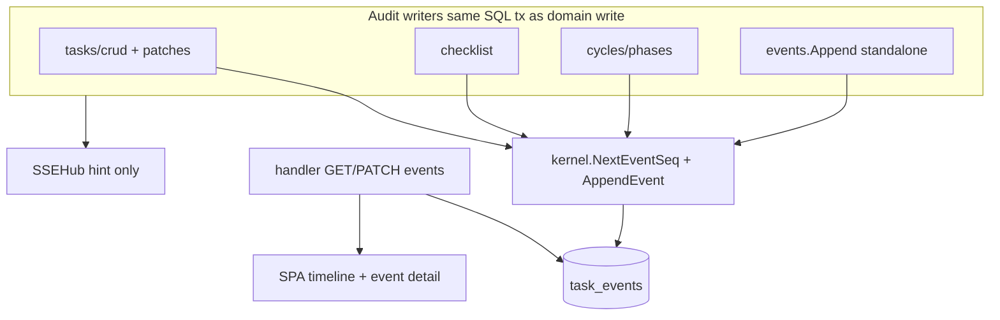

# Task events audit log

Durable, per-task history in `task_events`: append-only rows, cycle/phase mirrors, keyset paging, and the only interactive mutation — user response threads on `approval_requested` / `task_failed`.

| | |
| --- | --- |
| **Applies to** | `pkgs/tasks/store/internal/events/`, `pkgs/tasks/store/internal/kernel/events.go`, `pkgs/tasks/handler/handler_task_events.go`, `web/src/tasks/hooks/useTaskDetailEvents.ts`, `web/src/tasks/task-events/` |
| **Audience** | Contributors adding audit emit sites; frontend authors building the timeline or event detail page; operators debugging “what happened” |
| **Prerequisite** | [data-model.md](../data-model.md) (audit + cycles sections), [api.md](../api.md) (`GET/PATCH /tasks/{id}/events`) |
| **Companion articles** | [harness.md](./harness.md), [sse-hub.md](./sse-hub.md), [done-criteria.md](./done-criteria.md) |

## In this article

- [Overview](#overview)
- [Key concepts](#key-concepts)
- [How it works](#how-it-works)
- [Write workflow](#write-workflow)
- [Read workflow](#read-workflow)
- [User response workflow](#user-response-workflow)
- [Event type catalog](#event-type-catalog)
- [Cycle and phase mirror rows](#cycle-and-phase-mirror-rows)
- [Wire contracts](#wire-contracts)
- [SPA timeline vs cycle substrate](#spa-timeline-vs-cycle-substrate)
- [Observability](#observability)
- [Testing strategy](#testing-strategy)
- [Best practices](#best-practices)
- [Limitations](#limitations)
- [See also](#see-also)

## Overview

The **`task_events`** table is the append-only audit log for a task. Every meaningful mutation — task CRUD, checklist edits, status changes, cycle/phase transitions — appends one row with a monotonic per-task **`seq`**, a **`domain.EventType`**, an **`domain.Actor`**, and a JSON **`data`** object.

Clients read history through REST (`GET /tasks/{id}/events`, `GET /tasks/{id}/events/{seq}`). They do **not** receive audit rows over SSE.

> **Important** — `GET /events` (SSE) publishes **change hints** (`task_updated`, `task_cycle_changed`, …). It does **not** replay `task_events`. After an SSE hint, the SPA refetches REST — including the events list when the timeline is visible. See [sse-hub.md](./sse-hub.md).

### In scope

- Row shape, seq allocation, and `kernel.AppendEvent` invariants
- Store package `pkgs/tasks/store/internal/events/` and facade methods in `facade_events.go`
- HTTP handlers in `handler_task_events.go`
- Keyset paging (`before_seq` / `after_seq`) and `approval_pending`
- Interactive **`PATCH`** user-response threads (only two event types)
- SPA timeline, event detail route, and React Query cache keys

### Out of scope

- Typed execution substrate (`task_cycles`, `task_cycle_phases`) — authoritative for live state; see [data-model.md](../data-model.md)
- High-volume runner progress — `task_cycle_stream_events` + `GET …/cycles/{cycleId}/stream`; see [architecture.md](../architecture.md)
- SSE hub mechanics — [sse-hub.md](./sse-hub.md)
- Harness phase orchestration — [harness.md](./harness.md) (writes that produce mirror rows)

## Key concepts

| Term | Definition |
| --- | --- |
| **Audit row** | One `task_events` record: composite PK `(task_id, seq)`. |
| **`seq`** | Per-task monotonic integer starting at 1. Assigned inside the writer’s SQL transaction. |
| **`EventType`** | String enum in `domain.EventType` (`task_created`, `phase_started`, …). |
| **`Actor`** | Who caused the row: `user`, `agent`, or `system`. |
| **`data_json`** | Always a JSON **object** on the wire (`{}` when empty). Never SQL NULL or JSON `null`. |
| **Mirror row** | One of seven cycle/phase event types appended in the **same transaction** as a substrate write. |
| **Substrate** | `task_cycles` / `task_cycle_phases` — system of record for execution state. |
| **Response thread** | Ordered `response_thread_json` messages on interactive rows; legacy `user_response` columns kept in sync. |

### Authority model

| Question | Authoritative source |
| --- | --- |
| What phase is running right now? | `task_cycles` + `task_cycle_phases` (via `GET /tasks/{id}/cycles/…`) |
| What happened, in order, for debugging and the timeline? | `task_events` (via `GET /tasks/{id}/events`) |
| Did the UI miss a change? | SSE hint → refetch REST; audit log is not pushed live |
| Can the operator reply on this row? | Only if `domain.EventTypeAcceptsUserResponse(type)` is true |

> **Note** — Mirror rows are **observational**. Corrective work on cycles/phases creates **new** substrate rows and **new** mirror seqs; existing mirror rows are never updated (except the narrow response-thread exception below).

### Append-only with one exception

New events are **insert-only**. The only in-place mutation on an existing row is **`AppendResponseMessage`**: it updates `response_thread_json`, `user_response`, and `user_response_at` on rows whose type accepts user input. No other column on `task_events` is updated after insert.

## How it works



**Write path:** domain mutation → open transaction → (Postgres) lock parent `tasks` row → `NextEventSeq` → `AppendEvent` → commit → handler may `Publish` SSE hint (not the audit row).

**Read path:** client → `GET /tasks/{id}/events` → store list or keyset page → JSON envelope with `events[]`.

## Write workflow

All production appends funnel through **`kernel.NextEventSeq`** and **`kernel.AppendEvent`** (`pkgs/tasks/store/internal/kernel/events.go`).

1. **Parent task must exist.** Standalone `events.Append` counts the task row before allocating seq; orphan events are rejected.
2. **Seq allocation.** `SELECT COALESCE(MAX(seq),0)+1` after locking the `tasks` row (`SELECT … FOR UPDATE` on Postgres). Prevents duplicate `(task_id, seq)` under concurrent writers on the same task.
3. **Payload normalization.** `AppendEvent` runs `NormalizeJSONObject` on `data`. Nil, empty, whitespace, or JSON `null` become `{}`. Non-object JSON returns `domain.ErrInvalidInput`.
4. **Timestamp.** `At` is set to `time.Now().UTC()` at insert; it is not client-supplied.
5. **Transaction scope.** The append runs in the **same** `gorm.DB` transaction as the business write (task patch, checklist toggle, `StartPhase`, …). If the mirror insert fails, the whole transaction rolls back.

### Who writes audit rows

| Store entrypoint | Typical `EventType` values |
| --- | --- |
| `internal/tasks` create | `task_created` |
| `internal/tasks` patches | `status_changed`, `priority_changed`, `prompt_appended`, `message_added`, … |
| `internal/checklist` | `checklist_item_*` |
| `internal/cycles` | `cycle_started`, `cycle_completed`, `cycle_failed`, `phase_started`, `phase_completed`, `phase_failed`, `phase_skipped` |
| `internal/devmirror` | Dev ticker rotation (`sync_ping`, synthetic lifecycle) |
| `events.Append` (facade) | Ad-hoc append when no sibling domain write exists in the same tx |

Cycle/phase paths never call the public `events` package directly; they use the kernel helpers inside `internal/cycles` so dual-write stays colocated with substrate logic. See `internal/cycles/doc.go`.

### Standalone append

`Store.AppendTaskEvent` (`facade_events.go` → `events.Append`) wraps its own transaction: verify task exists, allocate seq, insert. Use when a mutation does not already have an open store transaction with a natural audit hook.

## Read workflow

Handlers: `handler_task_events.go`. Routes registered in `handler.go`.

### `GET /tasks/{id}/events`

Two modes (see [api.md](../api.md)):

| Query params | Ordering | Response shape |
| --- | --- | --- |
| *(none)* | **Ascending** `seq` (oldest → newest) | Full history. No `limit` / `total` / `range_*`. |
| `limit` and/or `before_seq` and/or `after_seq` | **Descending** `seq` (newest first) | Keyset page + paging metadata. |

**Rejected:** `offset` → `400` with message directing clients to keyset cursors.

**Always present:** `task_id`, `events`, `has_more_newer`, `has_more_older`, `approval_pending`.

**Paged-only fields:** `limit`, `total`, `range_start`, `range_end` (position labels counted from the newest row: “showing N–M of total”).

**Cursor semantics** (`events.PageCursor`):

| Cursor | SQL filter | Use |
| --- | --- | --- |
| *(first page)* | none | Newest `limit` rows |
| `before_seq=N` | `seq < N` | Older page |
| `after_seq=N` | `seq > N` | Newer page (still returned newest-first within the window) |

`before_seq` and `after_seq` are mutually exclusive. `limit` defaults to 50, coerced to `[1, 200]`. `limit=0` in the query string is treated as “use default 50” at the handler.

**Task existence:** List handler calls `Get(taskID)` first → `404` when the task is missing (including paged requests).

### `GET /tasks/{id}/events/{seq}`

Returns one row as `taskEventDetailResponse` (`task_id` + event fields). `404` when the task or `(task_id, seq)` pair is missing.

### `approval_pending`

Computed by `events.ApprovalPending`: among rows with type `approval_requested` or `approval_granted`, the **latest by seq** wins. If that row is `approval_requested`, `approval_pending` is `true`. Included on every list response so the SPA can badge the timeline without scanning events client-side.

## User response workflow

### Allowed types

`domain.EventTypeAcceptsUserResponse` returns true only for:

- `approval_requested`
- `task_failed`

Keep aligned with web `eventTypeNeedsUserInput` (`web/src/tasks/task-events/taskEventNeedsUser.ts`). Mirror cycle/phase types and all other event types return **`400`** `this event type does not accept thread messages`.

### `PATCH /tasks/{id}/events/{seq}`

Body: `{ "user_response": "<text>" }` (required non-empty after trim).

| Constraint | Value |
| --- | --- |
| Max message bytes (after trim) | 10 000 |
| Max thread entries | 200 |
| Allowed `by` on append | `user` (default from `X-Actor: user`) or `agent` (`X-Actor: agent`) |

**Store behavior** (`events.AppendResponseMessage`):

1. Load row under row lock (Postgres `FOR UPDATE`; SQLite relies on single-writer).
2. Reject if type does not accept responses.
3. Migrate legacy single `user_response` into thread form when `response_thread_json` is empty.
4. Append `ResponseThreadEntry{At, By, Body}`.
5. Sync `user_response` / `user_response_at` to the **latest user** message in the thread (legacy clients).
6. Return updated row.

**Handler:** On success, `notifyChange(TaskUpdated, taskID)` → SSE hint-only `task_updated`. The audit row itself is not streamed.

**Display helper:** `store.ThreadEntriesForDisplay(ev)` merges thread JSON with legacy columns for API responses and devsim.

## Event type catalog

Authoritative enum: `pkgs/tasks/domain/enums.go`. Parser allowlist: `parseEventType` in `web/src/api/parseTaskApiCore.ts` (must stay in sync when adding types).

### Task lifecycle and edits

| `EventType` | Typical trigger |
| --- | --- |
| `task_created` | `POST /tasks` |
| `status_changed` | `PATCH /tasks/{id}` status |
| `priority_changed` | Priority patch |
| `prompt_appended` | Initial prompt / append |
| `message_added` | Title or message-style patch |
| `context_added`, `constraint_added`, `success_criterion_added`, `non_goal_added`, `plan_added` | Structured planning payloads (when emitted) |
| `artifact_added` | Artifact recording |
| `approval_requested`, `approval_granted` | Approval gate flow |
| `task_completed`, `task_failed` | Terminal outcomes |

### Checklist

| `EventType` | Trigger |
| --- | --- |
| `checklist_item_added` | Add criterion |
| `checklist_item_updated` | Text or verify_commands edit |
| `checklist_item_toggled` | Agent/human done toggle |
| `checklist_item_removed` | Delete criterion |

### Execution mirrors (dual-write)

| `EventType` | Substrate write |
| --- | --- |
| `cycle_started` | `StartCycle` |
| `cycle_completed` | `TerminateCycle(succeeded)` |
| `cycle_failed` | `TerminateCycle(failed\|aborted)` |
| `phase_started` | `StartPhase` |
| `phase_completed` | `CompletePhase(succeeded)` |
| `phase_failed` | `CompletePhase(failed)` |
| `phase_skipped` | `CompletePhase(skipped)` |

### Dev / connectivity

| `EventType` | Notes |
| --- | --- |
| `sync_ping` | `HAMIX_SSE_TEST` dev ticker only; not production harness output |

## Cycle and phase mirror rows

Every cycle/phase mutation appends a mirror row **inside the same SQL transaction**. If the insert fails, the cycle/phase row rolls back — no orphaned substrate without audit, and no audit without substrate.

**`event_seq` pointer:** `StartPhase` and `CompletePhase` write the assigned `task_events.seq` into `task_cycle_phases.event_seq` in the same transaction. `CompletePhase` overwrites the value from `StartPhase` with the terminal mirror seq (one-shot pointer to the latest phase transition row).

**Payloads:** Mirror `data_json` carries structured snapshots (cycle ids, attempt seq, phase kind, status transitions, verification summaries on verify terminal phases). Substrate columns (`meta_json`, `details_json`) hold the canonical structured fields; mirror payloads are optimized for the human timeline.

**Interactivity:** Mirror types are excluded from `EventTypeAcceptsUserResponse`. Operators do not PATCH mirror rows; they use cycle APIs or start a new attempt.

> **Warning** — Do not treat mirror rows as writable execution state. Patching a phase through `PATCH …/phases/{phaseSeq}` writes substrate + a **new** mirror row; it does not rewrite an old audit seq.

## Wire contracts

### Event line (list and detail)

```json
{
  "seq": 42,
  "at": "2026-06-18T12:00:00Z",
  "type": "phase_completed",
  "by": "agent",
  "data": { },
  "user_response": "optional legacy field",
  "user_response_at": "2026-06-18T12:05:00Z",
  "response_thread": [
    { "at": "2026-06-18T12:05:00Z", "by": "user", "body": "Looks good" }
  ]
}
```

- **`data`:** always an object in JSON responses (`normalizeJSONObjectForResponse` in the handler).
- **`response_thread`:** omitted when empty; parser may synthesize one entry from legacy `user_response`.

### List envelope (paged example)

```json
{
  "task_id": "tsk_…",
  "events": [ ],
  "limit": 50,
  "total": 128,
  "range_start": 1,
  "range_end": 50,
  "has_more_newer": false,
  "has_more_older": true,
  "approval_pending": false
}
```

Contract tests: `handler_http_events_contract_test.go`.

### What is not in `task_events`

| Data | Durable home |
| --- | --- |
| Live Cursor tool stream lines | `task_cycle_stream_events` |
| Ephemeral `agent_run_progress` SSE frames | Not persisted |
| Full flat `domain.Task` snapshots | `tasks` row; SSE may inline on some `task_updated` frames |
| Checklist completion ledger | `task_checklist_completions` |
| Per-criterion verify evidence tables | `task_cycle_*_reports` (see [done-criteria.md](./done-criteria.md)) |

## SPA timeline vs cycle substrate

The SPA uses **two complementary surfaces**:

| Surface | API | Role |
| --- | --- | --- |
| **Updates timeline** | `GET /tasks/{id}/events` (paged) | Human-readable audit: labels via `taskEventLabels.ts`, highlights rows where `eventTypeNeedsUserInput`, links to `/tasks/{id}/events/{seq}` |
| **Cycle detail** | `GET /tasks/{id}/cycles/{cycleId}` | Live execution truth: phases, statuses, `cycle_meta`, `event_seq` on each phase |
| **Event detail page** | `GET /tasks/{id}/events/{seq}` | Deep-dive on one row; structured phase/cycle overviews from `parsePhaseEventOverview.ts` |
| **Runner stream (optional)** | `GET …/cycles/{cycleId}/stream` | Tool-level history, not mixed into the audit timeline |

**React Query:** `useTaskDetailEvents` uses `useInfiniteQuery` with keyset cursors (`before_seq` / `after_seq`) matching server `has_more_older` / `has_more_newer`. SSE `task_updated` invalidates task detail queries; the timeline refetches when mounted — it does not subscribe to per-row audit streaming.

**Authority rule for contributors:** UI that answers “can the agent proceed?” or “which phase is running?” must read **cycles**. UI that answers “what did we already tell the user?” or “show the conversation on this failure” reads **events** (and response threads).

**Timestamps:** Flat `domain.Task` JSON has no `created_at` / `updated_at`. Creation and subsequent edits appear as audit rows (`task_created`, `status_changed`, …).

## Observability

- Store latency histograms: `kernel.OpAppendTaskEvent`, `OpListTaskEvents`, `OpListTaskEventsPage`, `OpGetTaskEvent`, `OpAppendTaskEventResponse` (via `DeferLatency` in the events package).
- Debug trace logs: `operation` fields like `tasks.store.events.PageCursor`, `handler.Handler.taskEvents`.
- Ready-queue and reconcile code may join `task_events` for `task_created` ordering (`internal/ready`) — not a general audit replay mechanism.

## Testing strategy

| Layer | Location | What it pins |
| --- | --- | --- |
| HTTP contract | `handler_http_events_contract_test.go` | Full-list vs paged shapes, ordering, validation 400s, 404 |
| PATCH contract | `handler_http_events_patch_contract_test.go` | Thread append, type guards, SSE side effect |
| Dual-write rollback | `facade_cycles_test.go` | Mirror failure rolls back substrate |
| Store events | `facade_events_test.go` | Paging bounds, thread caps, `data_json` `{}` default |
| Domain guard | `event_user_response_test.go`, `cycle_state_test.go` | `EventTypeAcceptsUserResponse` excludes mirrors |
| Web parser | `parseTaskApi.test.ts` | Every `EventType` round-trip |
| SPA hook | `useTaskDetailEvents.test.tsx` | Infinite query cursors, `approval_pending` |

Default tests use SQLite via `tasktestdb.OpenSQLite`; no Postgres required.

## Best practices

- **Emit in the same transaction** as the mutation that motivates the row. Never append audit after commit in a separate transaction if rollback safety matters.
- **Use kernel helpers** from domain store packages; do not insert into `task_events` from handlers.
- **Keep `data` an object.** Use `EventPairJSON` for `{from,to}` transitions.
- **Add new `EventType` values in lockstep:** `domain/enums.go`, web `TASK_EVENT_TYPES` / `parseEventType`, `devsim.EventCycle` (if dev-visible), contract tests, and [api.md](../api.md) if HTTP-visible.
- **Do not publish audit rows on SSE.** Publish the existing hint types; let clients refetch events.
- **Prefer cycles API for mutations** on execution state; expect mirror rows to appear in the timeline automatically.

## Limitations

1. **No live audit stream.** Long timelines require polling or refetch after SSE hints; there is no `task_event_created` SSE type.
2. **Full-list mode loads all rows.** Default `GET /tasks/{id}/events` without params is appropriate for small histories only; the SPA always pages with `limit`.
3. **Single interactive mutation.** Only response threads on two event types; you cannot edit `data_json` or delete rows through the API.
4. **Mirror lag is zero only after commit.** In-flight transactions are invisible until commit; SSE may arrive before a follow-up GET sees the new seq (client should refetch).
5. **No cross-task audit query.** Events are scoped to one `task_id`; global failure views use `GET /tasks/cycle-failures` (cycle terminal metadata, not raw event export).
6. **Dev-only types.** `sync_ping` appears in devsim rotation; production harness does not rely on it.

## See also

| Doc / code | Why |
| --- | --- |
| [persistence.md](./persistence.md) | Facade layout, dual-write kernel, cross-domain transactions |
| [data-model.md](../data-model.md) | Table schema, dual-write table, `event_seq`, “where reads go” |
| [api.md](../api.md) | Route list, query params, error strings |
| [architecture.md](../architecture.md) | Persistence overview, SSE vs audit distinction |
| [sse-hub.md](./sse-hub.md) | Hint-only realtime; explicit out-of-scope for audit replay |
| [harness.md](./harness.md) | Cycle loop that produces mirror rows |
| [done-criteria.md](./done-criteria.md) | Verify snapshots embedded in phase mirror `data` |
| [pkgs/tasks/store/README.md](../../pkgs/tasks/store/README.md) | Facade map for `facade_events.go` and kernel |
| `pkgs/tasks/handler/handler_task_events.go` | HTTP entrypoints |
| `pkgs/tasks/store/internal/events/` | List, page, get, thread append |
