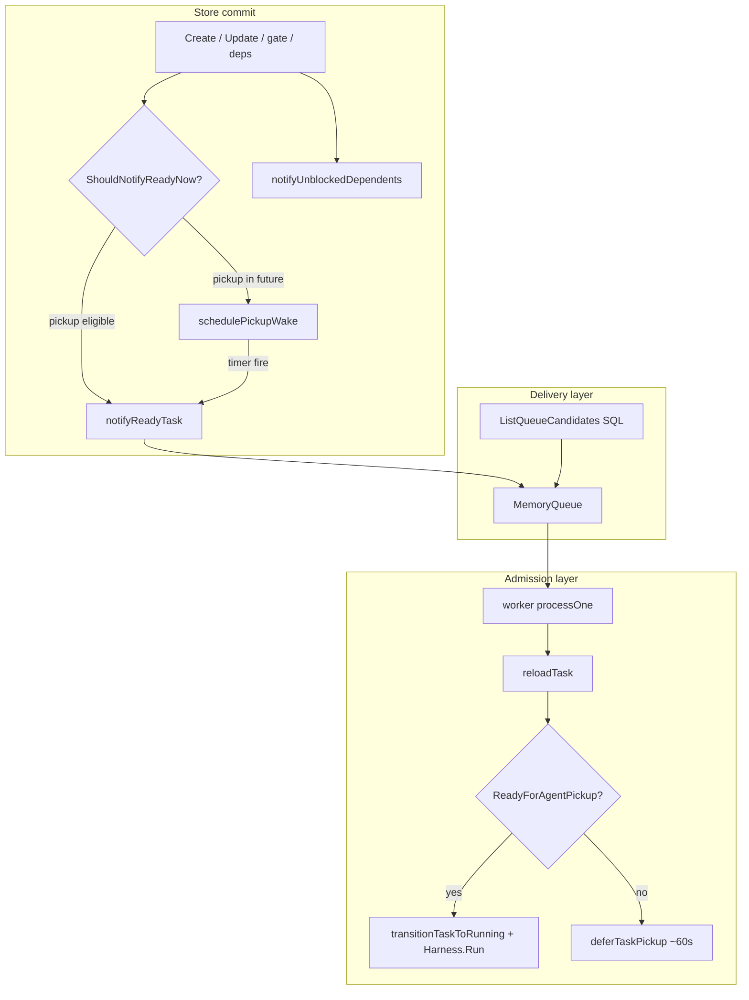
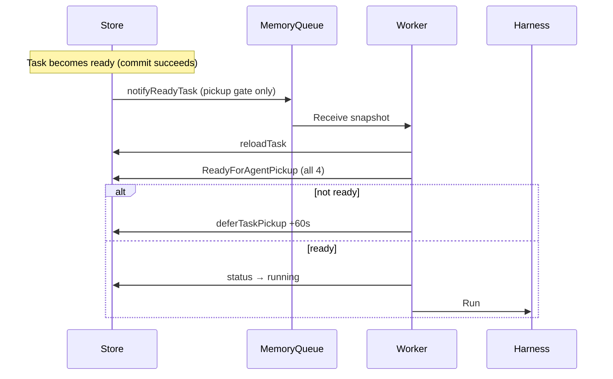
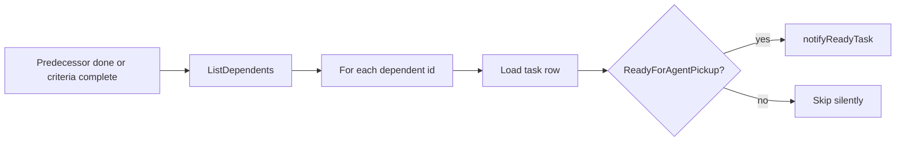

# Task scheduling and worker readiness

The four predicates that decide when a `ready` task may run, how the store unblocks dependents, operator `on_hold`, and the split between queue **enqueue** and worker **admission**.

| | |
| --- | --- |
| **Applies to** | [`pkgs/tasks/scheduling/`](../../pkgs/tasks/scheduling/), `pkgs/tasks/store/internal/ready/`, `pkgs/tasks/store/facade_tasks.go`, `pkgs/agents/worker/admission.go` |
| **Audience** | Contributors debugging tasks that stay `ready` but never run, dependents that never wake, or dequeue-then-skip behavior |
| **Prerequisite** | [data-model.md](../data-model.md) (dependencies, gate, `pickup_not_before`, worker readiness) |
| **Companion articles** | [agent-queue.md](./agent-queue.md) (in-memory enqueue), [harness.md](./harness.md) (cycle body after admission) |

## In this article

- [Overview](#overview)
- [Key concepts](#key-concepts)
- [How it works](#how-it-works)
- [The four predicates](#the-four-predicates)
- [ReadyForAgentPickup](#readyforagentpickup)
- [ShouldNotifyReadyNow vs full readiness](#shouldnotifyreadynow-vs-full-readiness)
- [Enqueue vs admission](#enqueue-vs-admission)
- [notifyUnblockedDependents](#notifyunblockeddependents)
- [on_hold](#on_hold)
- [Defer on failed admission](#defer-on-failed-admission)
- [SQL queue candidates](#sql-queue-candidates)
- [Workflows](#workflows)
- [Invariants](#invariants)
- [Configuration](#configuration)
- [Testing strategy](#testing-strategy)
- [Best practices](#best-practices)
- [Limitations](#limitations)
- [See also](#see-also)

## Overview

Hamix separates **when a task is allowed to run** (scheduling predicates on the task row) from **how work reaches the worker** (in-memory queue, pickup wake, reconcile). A task must pass four checks before the agent harness starts a cycle. Different code paths apply different subsets of those checks at different layers.

Scheduling answers: *"Is this `ready` row eligible for agent pickup right now?"* Delivery answers: *"Has a snapshot of this task been offered to the single worker goroutine?"* Those are related but not identical — a task can be enqueued and still be rejected at admission; conversely, a fully eligible task may wait until reconcile or pickup wake enqueues it.

> **Important** — [agent-queue.md](./agent-queue.md) owns `MemoryQueue`, reconcile, and ack ordering. This article owns the **readiness predicates** and the store/worker boundary that gates `Harness.Run`.

### In scope

- Four worker-readiness predicates (`status`, `pickup_not_before`, dependencies, gate) — authoritative Go path: [`scheduling/predicates.go`](../../pkgs/tasks/scheduling/predicates.go)
- `ReadyForAgentPickup` and `DependenciesSatisfied` (store delegates to scheduling)
- `ShouldNotifyReadyNow` (pickup-time gate at enqueue) — [`scheduling/pickup.go`](../../pkgs/tasks/scheduling/pickup.go)
- `notifyUnblockedDependents` / `NotifyUnblockedDependents`
- Worker `processOne` admission: reload, readiness, defer, `ready→running`
- SQL `ListQueueCandidates` / `applyDequeuableTaskPredicates`
- Operator `on_hold` and manual gate hold/release

### Out of scope

- Harness execute/verify loop — [harness.md](./harness.md)
- Queue capacity, dedup, reconcile tick — [agent-queue.md](./agent-queue.md)
- Checklist completion ledger semantics — [done-criteria.md](./done-criteria.md)
- SSE browser invalidation — [sse-hub.md](./sse-hub.md)

## Key concepts

| Term | Definition |
| --- | --- |
| **Worker readiness** | All four predicates pass for a task row at time `now` — evaluated by `scheduling.EvaluateWorkerReadiness` |
| **ReadyForAgentPickup** | Store wrapper: loads dependencies then delegates to scheduling |
| **ShouldNotifyReadyNow** | Pickup-time-only check via `scheduling.ShouldNotifyReadyNow` |
| **Enqueue** | `notifyReadyTask` → `MemoryQueue` (or reconcile SQL scan → notify); does not start a cycle |
| **Admission** | Worker `processOne`: reload row, re-check readiness, `ready→running`, then `Harness.Run` |
| **Dequeuable** | Passes SQL `applyDequeuableTaskPredicates` (deps + gate) in addition to `status=ready` and pickup time |

### Actors and trust

| Actor | Role | Trust |
| --- | --- | --- |
| **Store facade** | Commits mutations; may `notifyReadyTask`, `schedulePickupWake`, `notifyUnblockedDependents` | Trusted to fire notify after successful commit |
| **ready package** | SQL list of fair FIFO candidates with full SQL predicates | Trusted as reconcile/enqueue backstop filter |
| **Worker** | Reloads every dequeued snapshot; enforces full readiness before `Run` | Trusted single consumer; last line of defense |
| **Operator** | `on_hold`, gate actions, dependency edits | Trusted to use `ready` / gate semantics intentionally |

## How it works



Three layers:

1. **Persistence** — task row fields and dependency/gate tables ([data-model.md](../data-model.md)).
2. **Delivery** — optional in-process queue ([agent-queue.md](./agent-queue.md)); SQL reconcile uses the same dequeuable filter as list candidates.
3. **Admission** — worker reloads and applies `ReadyForAgentPickup` before flipping `ready→running`.

## The four predicates

Authoritative list: [data-model.md § Worker readiness](../data-model.md#worker-readiness-all-must-pass).

| # | Predicate | Field / rule | Fails when |
| --- | --- | --- | --- |
| 1 | **Status** | `status = ready` | `on_hold`, `running`, `done`, `failed`, etc. |
| 2 | **Pickup time** | `pickup_not_before` is null or `<= now()` | Operator or worker deferred pickup is still in the future |
| 3 | **Dependencies** | Every `depends_on` predecessor has `status = done` | Any predecessor not `done` (`failed`, `on_hold`, `ready`, …) |
| 4 | **Gate** | `gate` is null or `gate.status = released` | Manual approval gate still `locked`, `active`, or `pending_release` (and not released) |

Predicate 1 is evaluated first in `ReadyForAgentPickup` — non-`ready` rows short-circuit without hitting the database for dependencies.

Predicate 3 uses `EdgeSatisfied`: today the only `satisfies` value is `done`, implemented as `predecessor.Status == StatusDone` ([`dependency_edges.go`](../../pkgs/tasks/store/internal/tasks/dependency_edges.go)).

Predicate 4 uses `TaskGate.GateBlocksWorker()`: any non-`released` gate status blocks pickup ([`task_gate.go`](../../pkgs/tasks/domain/task_gate.go)).

## ReadyForAgentPickup

[`ReadyForAgentPickup`](../../pkgs/tasks/store/internal/tasks/readiness.go) is the single-task evaluator used at the worker boundary and in dependent-unblock notify:

```go
// Order of checks (simplified)
if t == nil || t.Status != domain.StatusReady { return false, nil }
if t.PickupNotBefore != nil && t.PickupNotBefore.After(now) { return false, nil }
if t.Gate != nil && t.Gate.GateBlocksWorker() { return false, nil }
return DependenciesSatisfied(ctx, db, t.ID)
```

[`DependenciesSatisfied`](../../pkgs/tasks/store/internal/tasks/readiness_deps.go) loads edges via `ListDependencyEdges`, loads each predecessor, and calls `EdgeSatisfied`.

The public facade re-exports the function:

```196:200:pkgs/tasks/store/facade_tasks.go
// ReadyForAgentPickup reports whether the task passes dequeue predicates.
func (s *Store) ReadyForAgentPickup(ctx context.Context, t *domain.Task, now time.Time) (bool, error) {
	slog.Debug("trace", "cmd", storeLogCmd, "operation", "tasks.store.ReadyForAgentPickup")
	return tasks.ReadyForAgentPickup(ctx, s.db, t, now)
}
```

**Contract:** same semantics as `ready.ListQueueCandidates` for one row (status, pickup, deps, gate). Tests pin SQL and Go alignment in [`readiness_test.go`](../../pkgs/tasks/store/internal/tasks/readiness_test.go).

## ShouldNotifyReadyNow vs full readiness

[`ShouldNotifyReadyNow`](../../pkgs/tasks/store/facade_tasks.go) checks **only predicate 2** (pickup time):

| `pickup_not_before` | `ShouldNotifyReadyNow` |
| --- | --- |
| `nil` | `true` — enqueue immediately after commit |
| `<= now` (including exactly equal) | `true` |
| `> now` | `false` — use `PickupWakeScheduler` or reconcile later |

Rationale (from facade godoc): the in-memory queue must not contain tasks whose pickup time is still in the future — that would race ahead of the SQL `pickup_not_before <= now()` filter and let the worker dequeue too early. `ShouldNotifyReadyNow` is the enqueue-time gate for **time only**.

**ShouldNotifyReadyNow does not check dependencies or gate.** Immediate `notifyReadyTask` after a `ready` transition can therefore enqueue a row that fails predicates 3 or 4. The worker catches that at admission (defer path). SQL reconcile (`ListQueueCandidates`) never offers those rows, so they are not re-enqueued by the backstop until predicates pass.

| Function | Predicates checked | Used where |
| --- | --- | --- |
| `ShouldNotifyReadyNow` | Pickup time only | `Create`/`Update` notify, `PickupWakeScheduler.tryNotify` |
| `ReadyForAgentPickup` | All four | Worker admission, `notifyUnblockedDependents` |
| `ListQueueCandidates` SQL | All four (in SQL) | Reconcile, fair FIFO candidate pages |

## Enqueue vs admission

| Concern | Enqueue path | Admission path |
| --- | --- | --- |
| **Trigger** | Store commit: transition to `ready`, pickup cleared/eligible, dependent unblocked | Worker dequeues from `MemoryQueue` |
| **Entry points** | `notifyReadyTask`, reconcile, pickup wake | `worker.processOne` |
| **Readiness check** | `ShouldNotifyReadyNow` on immediate notify; full SQL on reconcile | `ReadyForAgentPickup` on fresh row |
| **Status change** | None — row stays `ready` | `transitionTaskToRunning` before `Harness.Run` |
| **On failure** | `ErrQueueFull` / `ErrAlreadyQueued` (queue); commit still succeeds | Defer pickup, drop stale, or `Harness.Resume` for `running` |



> **Note** — Dequeued snapshots may be stale relative to `reloadTask`. Admission always reloads; never trust the channel payload alone.

See [agent-queue.md § Worker consumption and admission](./agent-queue.md#worker-consumption-and-admission) for ack-last ordering and `running` resume.

## notifyUnblockedDependents

When a **predecessor** becomes unblocking, the store walks **dependents** and enqueues those that are now fully ready.

**Triggers** ([`facade_tasks.go`](../../pkgs/tasks/store/facade_tasks.go), [`facade_checklist.go`](../../pkgs/tasks/store/facade_checklist.go)):

| Event | Call site |
| --- | --- |
| Predecessor reaches `status = done` | `Update` when `prev != done` and `updated == done` |
| Checklist becomes complete (`criteria_satisfied_at` set) | `SetChecklistItemDone`, `SetChecklistItemDoneWithEvidence` |

Flow:



Unlike the bare `ready` transition notify path, **dependent wake uses full `ReadyForAgentPickup`** — a dependent still blocked by gate, pickup time, or another predecessor is skipped without error.

`NotifyUnblockedDependents` is the exported alias for tests and explicit callers.

Errors listing dependents are `Warn`-logged; per-dependent load/readiness errors are skipped (`continue`), not propagated to the original mutation.

## on_hold

`on_hold` is an operator-controlled parking status ([data-model.md](../data-model.md#task-fields)). Pickup is gated on `status = ready`, so `on_hold` tasks fail **predicate 1** immediately:

- Never returned by `ListQueueCandidates`
- Never pass `ReadyForAgentPickup`
- Never transition to `running` via the worker

Operators move tasks `ready ↔ on_hold` with `PATCH /tasks/{id}` ([`handler_http_on_hold_contract_test.go`](../../pkgs/tasks/handler/handler_http_on_hold_contract_test.go)). Creating with `status: "on_hold"` is valid at `POST /tasks` — the row is persisted but not worker-eligible until returned to `ready`.

A predecessor in `on_hold` keeps dependents blocked (predicate 3) until the operator sets the predecessor to `done` or edits dependencies.

## Defer on failed admission

When the worker dequeues a `ready` task but `ReadyForAgentPickup` returns false (typically predicates 3 or 4, or pickup drift), [`deferTaskPickup`](../../pkgs/agents/worker/admission.go) sets `pickup_not_before` to approximately **60 seconds** ahead:

```118:120:pkgs/agents/worker/admission.go
	if !ready {
		w.deferTaskPickup(parentCtx, task.ID, 60*time.Second)
		return
	}
```

Effects:

- Avoids a tight spin when the task was enqueued before deps/gate caught up, or gate/release timing lagged notify
- Clears the task from immediate pickup; `PickupWakeScheduler` or reconcile can offer it again after the deferral
- Does **not** change `status` — the task remains `ready`

### Git binding gate (Plan 4)

After readiness passes, admission checks `task.worktree_id` and `task.branch_id`. When either is missing, the worker logs `missing_binding`, calls `deferTaskPickup` (~60s), and **does not** transition to `running`. This is separate from the four scheduling predicates — a task can be fully ready by deps/gate/pickup rules but still blocked until the operator binds a worktree (Plan 5 UI).

When binding is present, `prepareGitRun` acquires a per-`worktree_id` mutex, runs `gitwork.Checkout`, sets `Harness.SetWorkingDir` to the worktree path, then starts the harness. Checkout failures (`worktree_dirty`, `branch_checked_out`, `worktree_missing`, `branch_missing`) fail the task after pickup.

If readiness check errors (store failure), the worker logs and returns without defer — the id is still acked from the queue's pending set via deferred `AckAfterRecv`.

Other admission branches (no defer):

| Condition | Action |
| --- | --- |
| `reloadTask` not found | Info log; return |
| `status = running` + open cycle | `Harness.Resume` |
| Stale status (`done`, `failed`, …) | Warn; return |

## SQL queue candidates

[`ready.ListQueueCandidates`](../../pkgs/tasks/store/internal/ready/ready.go) pages `status = ready` tasks with:

```sql
pickup_not_before IS NULL OR pickup_not_before <= now()
```

plus [`applyDequeuableTaskPredicates`](../../pkgs/tasks/store/internal/ready/predicates.go):

- **Dependencies:** `NOT EXISTS` open edge where predecessor `status <> done`
- **Gate:** `gate IS NULL` OR `gate.status = 'released'` (JSON path; dialect-specific for SQLite vs Postgres)

Ordering: oldest `task_created` event first, dialect tie-breaker, then `tasks.id` — see [agent-queue.md](./agent-queue.md#ready-reconcile).

Reconcile enqueues candidates that are not already pending in `MemoryQueue`. This is the **durable backstop** that only offers fully dequeuable rows.

## Workflows

### New ready task (no blockers)

1. Client `POST /tasks` with `status=ready` (or update to `ready`).
2. Store applies default `pickup_not_before` from `agent_pickup_delay_seconds` when omitted ([configuration.md](../configuration.md)).
3. If pickup is in the future → `schedulePickupWake`; else if `ShouldNotifyReadyNow` → `notifyReadyTask`.
4. Worker receives snapshot → `reloadTask` → `ReadyForAgentPickup` → `ready→running` → `Harness.Run`.

### Ready task blocked by dependency

1. Dependent stays `ready` in DB but excluded from `ListQueueCandidates`.
2. May still hit the memory queue if transitioned to `ready` before edges were added (immediate notify does not check deps).
3. Worker admission fails readiness → `deferTaskPickup` ~60s.
4. Predecessor completes → `notifyUnblockedDependents` → dependent passes `ReadyForAgentPickup` → `notifyReadyTask`.

### Ready task behind manual gate

1. Gate `active` / `locked` / `pending_release` → predicate 4 fails.
2. SQL reconcile skips the row.
3. Operator `PATCH /tasks/{id}/gate` with `release` → gate `released`; SSE `task_gate_changed` / `task_updated`.
4. **No automatic queue notify** on gate-only patch — `Update` notify fires only on `transitionedToReady` or `pickupTouched`. Eligible tasks are picked up by reconcile (2m tick), pickup wake if applicable, or a subsequent status/pickup mutation.

### Operator parks task

1. `PATCH` `status: on_hold` → predicate 1 fails; pickup wake cancelled on non-ready update.
2. `PATCH` back to `ready` → treated as transition to `ready`; notify path runs with `ShouldNotifyReadyNow` / pickup wake.

## Invariants

| Invariant | Meaning |
| --- | --- |
| **Admission ⊆ readiness** | Worker never calls `Harness.Run` without passing all four predicates on the reloaded row |
| **Reconcile ⊆ SQL dequeuable** | `ListQueueCandidates` rows always pass pickup, deps, and gate in SQL |
| **Pickup enqueue gate** | Immediate `notifyReadyTask` never runs when `pickup_not_before > now` |
| **Dependent wake ⊆ readiness** | `notifyUnblockedDependents` only notifies when `ReadyForAgentPickup` is true |
| **on_hold ∉ worker** | `on_hold` never satisfies predicate 1 |
| **Persist beats notify** | Failed or skipped notify does not roll back the store commit |
| **Single running cycle** | `ready→running` transition happens at most once per admission path before harness starts |

## Configuration

| Knob | Default | Reference |
| --- | --- | --- |
| `agent_pickup_delay_seconds` | `5` | [configuration.md](../configuration.md) — default `pickup_not_before` on create when client omits pickup |
| `pickup_not_before` | per task | Operator or worker `deferTaskPickup` (~60s on failed admission) |
| `HAMIX_USER_TASK_AGENT_QUEUE_CAP` | `256` | Queue capacity — [agent-queue.md](./agent-queue.md), [configuration.md](../configuration.md) |
| Reconcile tick | `2m` | Fixed `ReconcileTickInterval` — backstop for gate release and missed notify |

Worker process enabled when at least one git repository is registered with a valid worktree path and agent not paused — supervisor in [agent-supervisor.md](./agent-supervisor.md). Tasks without `worktree_id`/`branch_id` are **not** picked up: admission defers pickup (~60s) until binding is set (Plan 5 UI).

## Testing strategy

| Layer | Files / focus |
| --- | --- |
| Pure policy | [`pkgs/tasks/scheduling/`](../../pkgs/tasks/scheduling/) — `predicates_test.go`, `pickup_test.go`, `decide_notify_test.go` |
| **Go ≡ SQL (I3)** | [`store/scheduling_parity_test.go`](../../pkgs/tasks/store/scheduling_parity_test.go) — merge blocker |
| SQL vs deps/gate | [`readiness_test.go`](../../pkgs/tasks/store/internal/tasks/readiness_test.go) — `ListQueueCandidates` excludes open dependency and held gate |
| Pickup boundary | [`facade_tasks_test.go`](../../pkgs/tasks/store/facade_tasks_test.go) — `TestShouldNotifyReadyNow_unitTable` |
| Worker admission defer | [`admission.go`](../../pkgs/agents/worker/admission.go) — logs `failed_predicate` at Debug |
| `on_hold` contract | [`handler_http_on_hold_contract_test.go`](../../pkgs/tasks/handler/handler_http_on_hold_contract_test.go) |
| Worker admission | [`worker_test.go`](../../pkgs/agents/worker/) with harness + `runnerfake` |
| Integration | [`pkgs/tasks/agentreconcile/`](../../pkgs/tasks/agentreconcile/) |

When adding a new readiness predicate, update **Go** (`scheduling/predicates.go`), **SQL** (`applyDequeuableTaskPredicates`), **`store/scheduling_parity_test.go`**, [data-model.md](../data-model.md), and this article in the same change.

## Best practices

- Treat **worker admission** as authoritative — do not assume queue presence implies eligibility.
- After changing dependencies or gate, expect **reconcile or dependent notify** to deliver work; gate-only release may wait up to one reconcile tick.
- Use `on_hold` for intentional parking; use `pickup_not_before` for time-based deferral; use **gate** for human approval.
- When adding store paths that transition to `ready`, follow existing `Create`/`Update` notify + pickup wake ordering in [`facade_tasks.go`](../../pkgs/tasks/store/facade_tasks.go).
- Prefer `notifyUnblockedDependents` pattern (full readiness before notify) when waking tasks after side conditions change.

## Limitations

| Limitation | Detail |
| --- | --- |
| Immediate notify vs full readiness | `notifyReadyTask` on `ready` transition checks pickup time only; deps/gate enforced at admission and SQL reconcile |
| Gate release latency | Gate-only `release` does not call `notifyReadyTask`; reconcile backstop up to 2m |
| Admission defer fixed | ~60s worker defer is hardcoded, not env-configurable |
| Dependency `satisfies` | Only `done` is implemented; `EdgeSatisfied` ignores the satisfies enum beyond status check |
| Gate auto-release | `pending_release_deadline_utc` does not auto-release without operator `clear_hold` path ([data-model.md](../data-model.md#gate)) |
| Clock skew | SQL `now()` in list candidates vs process `now` in Go checks — keep NTP aligned ([data-model.md](../data-model.md#scheduling-pickup_not_before)) |
| Criteria vs deps | `criteria_satisfied_at` is informational for deps; edges use predecessor `status = done` only |

## See also

### Documentation

| Doc | Content |
| --- | --- |
| [agent-queue.md](./agent-queue.md) | MemoryQueue, pickup wake, reconcile, ack semantics |
| [harness.md](./harness.md) | Cycle body after `ready→running` |
| [data-model.md](../data-model.md) | Dependencies, gate JSON, worker readiness list |
| [configuration.md](../configuration.md) | `agent_pickup_delay_seconds`, queue cap |
| [architecture.md](../architecture.md) | System overview |
| [runner-adapters.md](./runner-adapters.md) | Worker supervisor wiring |

### Code map

| Concern | Files |
| --- | --- |
| Readiness (Go) | [`readiness.go`](../../pkgs/tasks/store/internal/tasks/readiness.go), [`readiness_deps.go`](../../pkgs/tasks/store/internal/tasks/readiness_deps.go) |
| SQL candidates | [`ready/ready.go`](../../pkgs/tasks/store/internal/ready/ready.go), [`ready/predicates.go`](../../pkgs/tasks/store/internal/ready/predicates.go) |
| Store notify / unblock | [`facade_tasks.go`](../../pkgs/tasks/store/facade_tasks.go), [`facade_checklist.go`](../../pkgs/tasks/store/facade_checklist.go), [`store.go`](../../pkgs/tasks/store/store.go) |
| Gate actions | [`task_gate_action.go`](../../pkgs/tasks/store/internal/tasks/task_gate_action.go), [`handler_task_gate.go`](../../pkgs/tasks/handler/handler_task_gate.go) |
| Dependencies | [`dependencies.go`](../../pkgs/tasks/store/internal/tasks/dependencies.go), [`dependency_edges.go`](../../pkgs/tasks/store/internal/tasks/dependency_edges.go) |
| Domain gate / status | [`task_gate.go`](../../pkgs/tasks/domain/task_gate.go), [`enums.go`](../../pkgs/tasks/domain/enums.go) |
| Worker admission | [`admission.go`](../../pkgs/agents/worker/admission.go) |
| Pickup wake | [`pickup_wake.go`](../../pkgs/agents/pickup_wake.go) |
